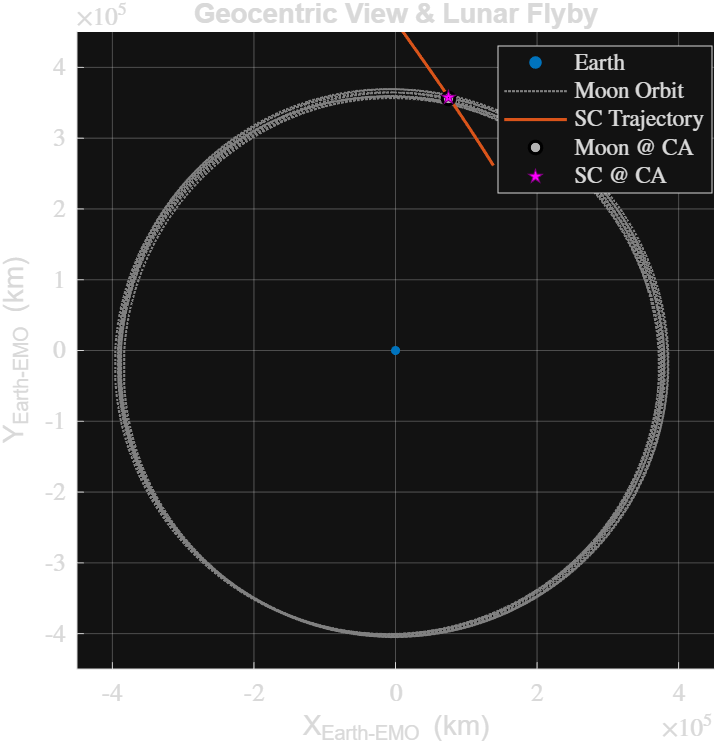
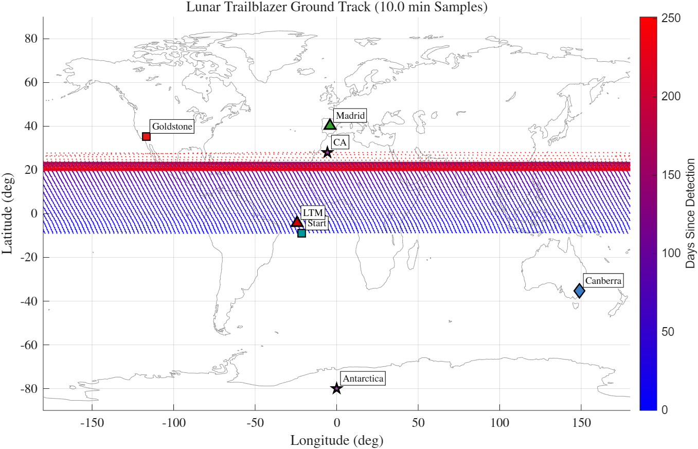
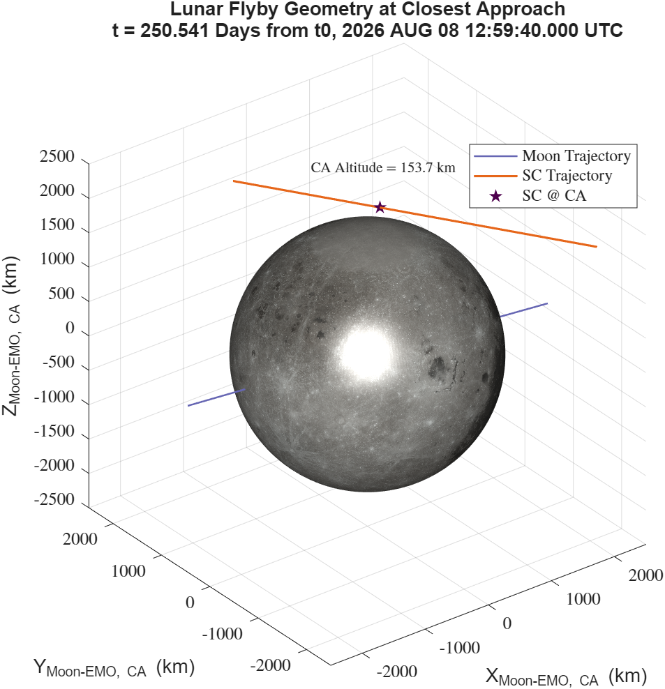

# 🚀 USC ASTE 583 Project – Lunar Trailblazer Navigation
## Visualizations

### Reference Trajectory

| Heliocentric Transfer | Geocentric Lunar Flyby |
| :---: | :---: |
|  |  |
| *Sun-centered view of the transfer orbit* | *Earth-centered view showing lunar flyby geometry* |

### Ground Track

<div align="center">
  
  <br>
  <em>Global ground track showing DSN station visibility and maneuver epochs.</em>
</div>

### Lunar Flyby Geometry 

<div align="center">
  
  <br>
  <em>3D Moon–centered view of the lunar flyby near closest approach (plot design adapted from Varsha Krishnakumar, used with permission).</em>
</div>

---

This repository implements the full Orbit Determination (OD) and maneuver analysis pipeline for the **Lunar Trailblazer** class project. It adheres strictly to:

- **ASTE583_Project.pdf** (project handout)
- ASTE 583 lecture slide decks (`Two-Body`, `STM`, `Covariance`, `Least Squares & Batch Filter`, `Sequential Kalman Filters`, `Measurements`, `Numerical Compensations`, `Orbital Perturbations`)

All force models, measurement models, and covariance conventions are pulled directly from these slides.

---

## 0. High-Level Pipeline

The project is organized into three phases:

1. **Phase 1 – Prime-Nav Reference:**
   - Propagate the **prime-nav reference trajectory** from detection through LTM and beyond.
   - Generate heliocentric / geocentric plots and a global ground track.

2. **Phase 2 – Orbit Determination:**
   - **Preliminary OD (0–6 days):**
     - Batch Least Squares (10-state).
     - Sequential Kalman Filter (10-state).
     - Compare residuals & RTN covariances, and check passthru on 6–14 day data.
   - **Final OD (0–14 days):**
     - Iterated CKF at the **detection epoch** using full 0–14 day radiometric arc.
     - Final residuals and covariance at LTM.

3. **Phase 3 – Maneuvers & Statistics:**
   - Predict the **LTM range-rate signature** (with vs. without maneuver).
   - Monte Carlo analysis of **cleanup maneuver (LCM)** and total ΔV budget compliance.

---

## 1. Repository Structure

```text
totesirfan-aste_583_project_irfan_can/
├── init_project.m                     # Path setup & SPICE kernel loading
├── lib_constants.m                    # Centralized constants & configuration
├── lib_dynamics.m                     # Dynamics model (Sun, Earth, SRP)
├── lib_measurements.m                 # Measurement model (range, Doppler, H)
├── load_project_measurements.m        # Loader/merger for 0–6D and 6–14D CSVs
├── Phase1_Main_RefTraj.m              # Phase 1: Prime-nav reference trajectory
├── Phase2_Prelim_Batch.m              # Phase 2: Preliminary Batch LS (0–6D)
├── Phase2_Prelim_Kalman.m             # Phase 2: Preliminary CKF (0–6D)
├── Phase2_Prelim_Plots.m              # Phase 2: Residuals & RTN comparisons
├── Phase2_Prelim_Passthru.m           # Phase 2: 6–14D passthru test
├── Phase2_Final_Kalman.m              # Phase 2: Final Iterated CKF (0–14D)
├── Phase2_FinalKalman_PostProcess.m   # Phase 2: Final residuals & LTM RTN
├── Phase3_ManeuverExecution.m         # Phase 3: LTM RR maneuver signature
└── Phase3_CleanupStats.m              # Phase 3: Cleanup Monte Carlo statistics
```

> **Note:** The **primary function name** in each `.m` file is assumed to match the filename (e.g., `Phase3_ManeuverExecution.m` defines `function Phase3_ManeuverExecution`).

---

## 2. External Dependencies

### 2.1 MATLAB

* Tested in **MATLAB R202x** (base MATLAB only).
* Uses:
  * ODE integration: `ode45`
  * File I/O: `readtable`, `load`, `save`
  * Interpolation: `interp1`
  * Linear algebra: `chol`, `eig`, `blkdiag`
  * Basic plotting: `plot`, `scatter`, `histogram`, `legend`, etc.

No additional toolboxes are required.

### 2.2 SPICE / MICE

The project uses **NAIF SPICE (MICE)** for:
* Ephemerides (`cspice_spkezr`)
* Time conversions (`cspice_str2et`, `cspice_et2utc`)

You **must** edit `init_project.m` to point to your local installation:

```matlab
% In init_project.m
mice_root = 'C:\path\to\mice';   % <-- Change to your MICE installation
if exist(mice_root, 'dir')
    addpath(genpath(mice_root));
else
    error('ERROR: Could not find MICE at: %s', mice_root);
end

kernels = {
    'C:\path\to\kernels\de440s.bsp';       % Planetary/multipurpose SPK
    'C:\path\to\kernels\naif0012.tls.pc';  % Leapseconds / time conversions
};
```

**If you see:**
* `Undefined function or variable 'cspice_spkezr'` → MICE path is not correct in `init_project.m`.
* `SPICE(KERNELNOTFOUND)` or similar → One of the kernel paths in `kernels` does not exist on your machine.

### 2.3 Measurement Data (CSV)

The OD code expects **two CSV files** either in the **current folder** or somewhere on the **MATLAB path**:

1. `ASTE583_Project_LTB_Measurements_0-6D_Truth.csv`
2. `ASTE583_Project_LTB_Measurements_6D-14D_Truth.csv`

`load_project_measurements.m` reads them, merges them, sorts by time, and returns a single struct.

---

## 3. Frames, Units & Conventions

* **Dynamical frame:** Sun-centered **EMO2000** (Earth Mean Obliquity of J2000).
* **Earth rotation:** Simple rotation about EMO z-axis with:
  * Greenwich sidereal angle at detection epoch: `const.phi_G_detect`
  * Constant rotation rate: `const.we`
* **OD state vector (10-state):**
  ```matlab
  X = [r_x, r_y, r_z, v_x, v_y, v_z, k_SRP, rho_dot_bias, lat_4, lon_4]';
  ```
  where:
  * `r` (km), `v` (km/s) – spacecraft in EMO2000
  * `k_SRP` – SRP scale factor (dimensionless)
  * `rho_dot_bias` – Doppler bias (km/s), active only in 0–6 day span
  * `lat_4`, `lon_4` – station 4 (Antarctica) latitude/longitude (rad)

* **Units:**
  * Position: **km**
  * Velocity: **km/s**
  * Time:
    * Internal: **ET seconds** (SPICE)
    * Plots: **days since detection** (`(t - t0) / 86400`)
  * Angles: **radians** internally; **degrees** only for printed/plot labels
  * Doppler: **km/s** (residual plots often scaled to **mm/s**)

---

## 4. Data & Intermediate Files

### 4.1 Required Inputs

* **CSV files** (measurement data):
  * `ASTE583_Project_LTB_Measurements_0-6D_Truth.csv`
  * `ASTE583_Project_LTB_Measurements_6D-14D_Truth.csv`
* **SPICE kernels** (paths set in `init_project.m`):
  * `de440s.bsp`
  * `naif0012.tls.pc`

### 4.2 Generated `.mat` Files (In Order)

These are created by scripts in **Phase 2** and used later:

1. **`ASTE583_PrelimBatch_Results.mat`**
   * **Created by:** `Phase2_Prelim_Batch.m`
   * **Used by:** `Phase2_Prelim_Plots.m`, `Phase2_Prelim_Passthru.m`, `Phase2_Final_Kalman('batch')`
   * **Key variables:**
     * `prelim_results.X0_batch` (10×1) – final Batch LS estimate.
     * `prelim_results.P0_batch` (10×10) – posterior covariance.

2. **`ASTE583_PrelimKalman_Results.mat`**
   * **Created by:** `Phase2_Prelim_Kalman.m`
   * **Used by:** `Phase2_Prelim_Plots.m`, `Phase2_Prelim_Passthru.m`, `Phase2_Final_Kalman('kalman')`
   * **Key variables:**
     * `kf_results.X0_KF` (10×1) – preliminary CKF state.
     * `kf_results.P0_KF` (10×10) – CKF posterior covariance.

3. **`ASTE583_FinalKalman_Results.mat`**
   * **Created by:** `Phase2_Final_Kalman.m`
   * **Used by:** `Phase2_FinalKalman_PostProcess.m`, `Phase3_ManeuverExecution.m`, `Phase3_CleanupStats.m`
   * **Key variables:**
     * `X0_final_kalman` (10×1) – final iterated CKF state.
     * `P0_final_kalman` (10×10) – final covariance.
     * `rho_prefit`, `rr_prefit`, etc. – full 0–14 day residuals.

> Running Phase 3 **requires** a valid `ASTE583_FinalKalman_Results.mat` in the working directory.

---

## 5. Quick Start – Execution Order & Requirements

### 5.1 One-Time Setup (per MATLAB session)

```matlab
% 1) Add MICE & kernels, check paths
init_project();

% 2) Load constants (optional, for inspection)
const = lib_constants();
```
If this succeeds without errors or missing-kernel warnings, you’re good to go.

### 5.2 Phase 1 – Prime-Nav Reference Trajectory

**Script:** `Phase1_Main_RefTraj.m`
**Usage:**
```matlab
Phase1_Main_RefTraj;
```
**What it does:**
* Propagates Detection → LTM (prime-nav state) → Final.
* Applies nominal LTM ΔV.
* **Outputs:** Heliocentric view, Geocentric flyby view, Global ground track.

### 5.3 Phase 2 – Preliminary OD (0–6 days)

#### 5.3.1 Batch LS – 10-State
**Script:** `Phase2_Prelim_Batch.m`
```matlab
Phase2_Prelim_Batch;
```
* Solves 10-state Batch LS using 0–6 day data.
* Creates `ASTE583_PrelimBatch_Results.mat`.

#### 5.3.2 Sequential CKF – 10-State
**Script:** `Phase2_Prelim_Kalman.m`
```matlab
Phase2_Prelim_Kalman;
```
* Runs a single-pass 10-state CKF.
* Creates `ASTE583_PrelimKalman_Results.mat`.

#### 5.3.3 Preliminary Plots & RTN Comparison
**Script:** `Phase2_Prelim_Plots.m`
```matlab
Phase2_Prelim_Plots;
```
* Plots prefit vs postfit RR residuals (mm/s).
* Plots 3σ RTN error ellipses comparing Batch vs. Kalman.

#### 5.3.4 Passthru Test – 6–14 Days
**Script:** `Phase2_Prelim_Passthru.m`
```matlab
Phase2_Prelim_Passthru;
```
* Propagates prelim solutions to 14 days.
* Checks O–C residuals against the 6–14 day measurement set.

### 5.4 Phase 2 – Final OD (0–14 days)

#### 5.4.1 Iterated CKF at Detection Epoch
**Script:** `Phase2_Final_Kalman.m`
```matlab
% Preferred (physically consistent SRP):
Phase2_Final_Kalman('handout');
```
* Iterates a centralized CKF at t₀ using the full 0–14 day arc.
* Creates `ASTE583_FinalKalman_Results.mat`.

#### 5.4.2 Final Residuals & Covariance at LTM
**Script:** `Phase2_FinalKalman_PostProcess.m`
```matlab
Phase2_FinalKalman_PostProcess;
```
* Plots final range and RR residuals (mm/s).
* Propagates covariance to LTM and prints **RTN sigmas** for the write-up.

### 5.5 Phase 3 – Maneuvers & Statistics

#### 5.5.1 LTM Maneuver Range-Rate Signature
**Script:** `Phase3_ManeuverExecution.m`
```matlab
Phase3_ManeuverExecution;
```
* Propagates trajectories with and without LTM.
* Computes and plots ΔRR (Doppler signature) to assess LTM detectability.

#### 5.5.2 Cleanup Maneuver Monte Carlo Statistics
**Script:** `Phase3_CleanupStats.m`
```matlab
Phase3_CleanupStats;
```
* Performs Monte Carlo (N=10,000) on the cleanup maneuver (LCM).
* Calculates ΔV_LCM statistics and checks compliance with `const.dV_budget`.

---

## 6. Implementation Notes & Sanity Checks

* **Integrator settings:** `ode45` is used with tight tolerances (`RelTol ≈ 1e-10`, `AbsTol ≈ 1e-9`) for stable propagation.
* **Random seed:** Monte Carlo in `Phase3_CleanupStats` uses `rng(583)` for reproducibility.
* **SRP scale factor (k_SRP):** For the final reported solution, the **iterated CKF with 'handout' prior** is used to maintain `k_SRP > 0`.
* **Measurement sanity check:** `lib_measurements.m` has been cross-checked against the provided sample point (Station 1, t ≈ 6.06 days) to ensure accuracy.

---

## 7. Credits

**Authors:** Irfan & Can  
**Course:** ASTE 583 – Navigation & Estimation (USC)

Implementation and modeling choices follow the **Lunar Trailblazer OD project handout** and the official ASTE 583 lecture slides.
